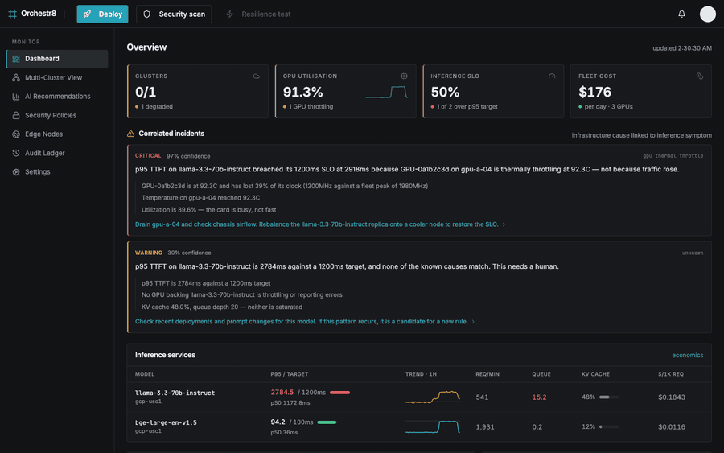

# Orchestr8

**Your inference is slow. Is it the model, the traffic, or the silicon?**

Orchestr8 reads your GPUs and your inference engines together and tells you which one, with the measurements behind it. Every other tool tells you latency is high.

<p align="center">
  
  
  
  
  
</p>

---

<p align="center">
  
</p>

<p align="center">
  <em>A GPU starts throttling. The dashboard names the cause, the verdict shows the evidence, and headroom says whether you can afford to drain the node.</em><br>
  <sub><a href="docs/media/demo.mp4">Download as MP4</a> · recorded against the running stack, no mock data</sub>
</p>

---

## The problem

Two incidents. Identical symptom — p95 time-to-first-token breaches its SLO. Identical alert.

| | Incident A | Incident B |
|---|---|---|
| p95 TTFT | 1,809 ms (target 1,200 ms) | 2,909 ms (target 1,200 ms) |
| GPU temperature | **92.3 °C** | healthy |
| SM clock | **1,200 MHz** of a 1,980 fleet peak | full clock |
| Request rate | flat — 336/min vs a 343/min baseline | **+59%** |

Incident A is a thermally throttling card. Drain the node.

Incident B is capacity. Draining a node makes it **worse**.

Those are two verdicts this engine actually wrote, verbatim:

> p95 TTFT on llama-3.3-70b-instruct breached its 1200ms SLO at 1775ms because GPU-0a1b2c3d on gpu-a-04 is thermally throttling at 90.0C — **not because traffic rose**.

> p95 TTFT on llama-3.3-70b-instruct is 2909ms against a 1200ms target because request rate rose +59%. **The hardware is healthy** — this is capacity, not a fault.

A latency dashboard shows you the same red number for both, and the on-call engineer picks by instinct at 3am. Orchestr8 exists to remove the guess: it joins the infrastructure signal to the inference symptom and will only name a cause when it can evidence both.

## What it actually does

**Correlates, rather than charts.** Five rules run over every organisation's telemetry on a rolling window — thermal throttle, GPU memory pressure, KV cache saturation, XID hardware faults, and traffic surge. A verdict names the symptom, the cause, a confidence, and the evidence for each — including what it *ruled out*. "Request rate is flat (336/min against a 343/min baseline, −2%) — load did not cause this" is a line the engine writes, because the negative is what makes the positive trustworthy.

An empty incident list means no cause was **provable**, not that nothing is wrong. The product says so on the page.

<p align="center">
  
</p>

The second card in that screenshot is the one worth looking at: *"none of the known causes match. This needs a human."* Five rules cannot explain everything, and a tool that invents a sixth explanation to fill the space is worse than one that says it does not know.

**Headroom, measured — never extrapolated.** How much more load each service has absorbed before missing its target, and what it costs to lose one GPU. Built entirely from history already in the store: `Losing one of 2 GPUs leaves 669 req/min on each remaining card. This service has run at that load and served 2,512 ms p95, against a 1,200 ms target.` → **DO NOT DRAIN**. Where history has never covered a load level, it refuses to answer rather than guessing — someone is deciding whether to pull a card out of production on the strength of it.

**Security scanning that stores what it found.** Trivy against any container image or path, run as background work the page polls, so a multi-gigabyte model image is scannable. Every run is persisted with a CycloneDX SBOM, so a CVE published tomorrow can be matched against what you already shipped without rebuilding. An empty result on an end-of-life OS is reported as *"nothing found, but nothing is watching"* — not as a pass.

**An audit ledger you can verify.** Every deploy, scan, SLO change, invitation and token issue is hash-chained. `GET /v1/audit/verify` walks the chain and reports the first entry that does not match.

**Multi-tenant to the storage layer.** `OrgId` is the first column of every sort key in ClickHouse and the first clause of every query. Two organisations can run clusters with the same name and GPUs with the same UUID and never see each other's data.

## How it fits together

```
 NVIDIA DCGM ─┐
              ├─→ OTel Collector ──→ ingest gateway ──→ ClickHouse ──→ Go API ──→ Next.js
 vLLM metrics ┘    (per cluster)      (:4319, authn)     (rollups)     (:8088)     (:3001)
                                            │                             │
                                            │                       correlation
                                      ingest token                    engine
                                     ↓                                    │
                              Postgres control plane ←────────────────────┘
                        orgs · users · sessions · clusters · tokens · invites
```

**Telemetry** is OpenTelemetry end to end. DCGM exports GPU temperature, clock, utilisation, memory and XID; vLLM exports TTFT histograms, request rate, queue depth and KV-cache usage. The collector runs inside the customer's cluster — their telemetry leaves with an ingest token scoped to one organisation and one cluster, and the gateway refuses a payload whose claimed identity does not match its token.

**Storage** is ClickHouse with per-minute `AggregatingMergeTree` rollups and a 13-month TTL. Histogram quantiles are interpolated in Go rather than stored pre-bucketed.

**The control plane** is Postgres — the transactional things: who exists, who belongs to which organisation, which tokens are live. Sessions are database-backed on purpose: a JWT cannot be revoked, and revoking access is the entire point of having it.

**The contract** between Go and TypeScript is enforced, not documented. `packages/contracts` holds zod schemas; `services/api/contract_test.go` validates the *same golden fixtures* against the Go structs. Change one side without the other and `make check` fails on whichever side you forgot.

## Quick start

Needs Docker, Go 1.21+, Node 22+, and `clickhouse` + `psql` on PATH.

```bash
git clone https://github.com/yash37158/Orchestra8.git
cd Orchestra8
npm install
make up          # clickhouse, control plane, GPU simulator, collector, API, web
```

Open **http://localhost:3001**. The landing page is public; sign in to reach the product.

No GPUs required — `services/devkit` simulates a fleet, and you can drive it into a known fault:

```bash
make fault      # a GPU overheats: slow AND throttling
make surge      # the decoy: slow with NO throttling, hardware healthy
make healthy    # back to baseline
make scenarios  # list faults and show the active one
```

Run `make fault`, wait for the engine to sweep, and the dashboard names a thermally throttling card. Run `make surge` and it says traffic — and says the hardware is fine. That difference is the product.

```bash
make status     # what is running
make logs       # tail every background service
make down       # stop everything
```

## Verification

Behaviour that matters is proved by a script that tries to break it, not by a unit test asserting a mock.

```bash
make verify-ingest     # 12 probes: every attack fails, the one legitimate write lands
make verify-auth       # 15 probes: no credential reaches no data, revocation is immediate
make verify-invites    # 19 probes: who may issue one, and everything accept refuses
make verify-headroom   # 11 probes: measurements only, a refusal whenever history cannot answer
make verify-engine     #  2 cases: inject a known fault, assert the verdict
make check             # cross-language contract check
make audit             # verify the audit hash chain
```

`verify-ingest` proves, against a real k3s cluster, that a collector cannot reach the storage path directly, that a token for one organisation cannot write as another, that a revoked token stops working immediately, and that the control plane going down costs **zero** samples — the gateway answers 503 rather than 401, because OTLP exporters retry a 5xx and drop a 4xx.

## Deploying

```bash
make images                        # build the API and web images
make deploy                        # helm install into the current kube context
```

The chart stands up ClickHouse, Postgres, the API, the collector and the web app, runs schema migrations from an init container behind a `pg_advisory_lock`, and generates an auth secret on first install that it will not rotate underneath you on upgrade. Everything runs as uid 10001 under `runAsNonRoot`.

Onboarding a customer cluster is one Helm install of `deploy/helm/orchestr8-collector` with an ingest token issued from the UI.

## What is not built yet

The product marks its own gaps rather than rendering an empty chart, because an empty chart is indistinguishable from a healthy one — which is the failure mode this whole thing exists to remove. In that spirit:

- **Roles are recorded but not enforced** on infrastructure actions. A viewer can still deploy. Invitations enforce who may grant what; the write paths do not yet check.
- **No admission controller.** Policy evaluation needs Kyverno or OPA Gatekeeper reachable from the collector. Deploy preflight reports the check as *skipped*, never as passed.
- **No runtime sensor.** Runtime threat detection needs Falco streaming into the collector.
- **Scans are manual.** There is no nightly or on-deploy schedule yet.
- **Private registries.** Scanning an image from a private registry needs credentials mounted into the API pod.
- **Scan targets come from deploy history**, so they cover what was deployed through Orchestr8. Having the collector report container image names would cover everything actually running.

## Layout

```
apps/web            Next.js 15 / React 19 dashboard and landing page
services/api        Go API, correlation engine, ingest gateway, scanner, audit ledger
services/collector  OpenTelemetry collector configs
services/devkit     GPU fleet simulator — DCGM and vLLM metrics, no hardware
services/control    Postgres control-plane migrations
packages/contracts  zod schemas + golden fixtures, validated from both languages
deploy/helm         platform chart and the customer-side collector chart
scripts             the verify-* suites
config              SLO definitions
```

## Design notes

A few decisions that are load-bearing:

- **Confidence is shown, and a low one is labelled.** Below 60% the page says *"treat this as a possible cause, not a diagnosis"* rather than quietly presenting a guess as a verdict.
- **Every evidence line is checkable.** Each one carries the metric and the exact window, and the UI draws that series so the reader can see the claim rather than take it on faith.
- **"No findings" and "could not run" never look the same** — in scan results, in preflight checks, in the correlation list.
- **A shared link is pinned to its window.** A correlation opened tomorrow shows what the sender saw, not "the last 15 minutes".
- **Time in the app is a cost, not engagement.** Every correlation has four exits that get the engineer out with the matter settled.

## License

Not yet licensed. Add a `LICENSE` file before using this anywhere that matters.
